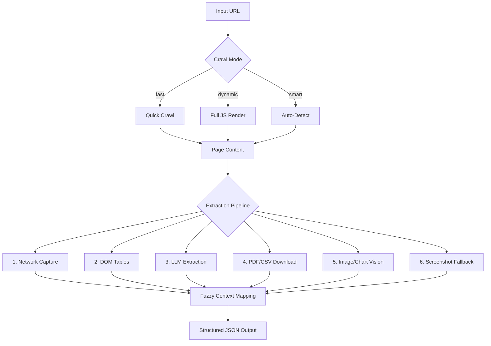

# Web Data Extractor

**Production-ready Python tool for extracting structured data from complex web sources.**

Handles JavaScript-rendered content, charts/graphs via AI vision, complex HTML tables, PDFs, and normalizes output to clean JSON format suitable for LLM ingestion.

---

## 🚀 Quick Start

> **Recommended:** Use `uv` for 10x faster dependency installation.

### Step 1: Install uv (Package Manager)

**Windows (PowerShell):**
```powershell
powershell -ExecutionPolicy ByPass -c "irm https://astral.sh/uv/install.ps1 | iex"
```

**macOS / Linux:**
```bash
curl -LsSf https://astral.sh/uv/install.sh | sh
```

### Step 2: Setup Project

```bash
# Create virtual environment
uv venv

# Activate virtual environment
# Windows:
.venv\Scripts\activate
# macOS/Linux:
source .venv/bin/activate

# Install all dependencies
uv sync
```

### Step 3: Install Browser (Required for Crawling)

```bash
# Install Playwright browsers (Chromium for headless crawling)
uv run python -m playwright install
```

### Step 4: Configure API Key

```bash
# Create .env file with your Gemini API key
# Get key at: https://aistudio.google.com/app/apikey
echo "GEMINI_API_KEY=your_key_here" > .env
```

### Step 5: Run the Crawler

```bash
# Basic extraction
uv run python crawler.py "https://www.worldometers.info/world-population/"

# Full smart mode with depth crawling (recommended)
uv run python crawler.py "https://www.worldometers.info/world-population/" --mode smart --depth smart

# Create RAG Knowledge Base from existing extraction
uv run python crawler.py --rag-only output/worldometers_info_20260112_091704/data.json
```

## 🧠 RAG Knowledge Base Integration

After extraction, the tool can automatically upload the structured data to **Gemini File Search**, creating a searchable Knowledge Base for Q&A.

**Features:**
- Automatic indexing of extracted JSON
- Python and cURL code generation for querying
- Zero-cost storage (part of Gemini API free tier)

**Example Query:**
> "What are the top 5 countries by population growth rate?"

---

## 🐍 Alternative: Using pip (Standard Python)

If you prefer not to use `uv`, standard Python setup works:

```bash
# Create and activate virtual environment
python -m venv .venv

# Windows:
.venv\Scripts\activate
# macOS/Linux:
source .venv/bin/activate

# Install dependencies
pip install -r requirements.txt

# Install Playwright browsers
python -m playwright install

# Initialize crawl4ai (downloads browser components)
crawl4ai-setup

# Configure API key
echo "GEMINI_API_KEY=your_key_here" > .env

# Run the crawler
python crawler.py "https://www.worldometers.info/world-population/" --mode smart --depth smart
```

---

## 📋 Problem Statement

This project addresses the **CloudSufi Internship Challenge: Web Data Extraction**. The goal is to bridge complex, visually-optimized web data with clean, standardized JSON formats required for LLM ingestion.

**Challenge Areas:**
- Dynamic, JavaScript-rendered elements (interactive charts, filterable tables)
- Visual media requiring Vision Models for data extraction
- Inconsistently structured or deeply nested HTML tables
- PDFs and downloadable documents

---

## 🏗️ Architecture Overview



---

## 🔄 Extraction Flow (Smart Mode)

The **smart mode** is the ideal extraction path, combining all techniques:

### Step 1: Intelligent Crawling
```
URL → Fast Crawl → Check for Placeholders → Retry with Dynamic if needed
```

### Step 2: Layered Extraction (Priority Order)
```
┌─────────────────────────────────────────────────────────────┐
│  1. NETWORK CAPTURE (Highest Priority)                      │
│     • Intercepts XHR/fetch JSON responses                   │
│     • Gets actual API data (most accurate)                  │
├─────────────────────────────────────────────────────────────┤
│  2. DOM TABLES                                              │
│     • Direct HTML table parsing via crawl4ai                │
│     • Preserves exact numbers from page                     │
├─────────────────────────────────────────────────────────────┤
│  3. LLM EXTRACTION (Fallback)                               │
│     • Gemini analyzes markdown content                      │
│     • Extracts tables from unstructured text                │
├─────────────────────────────────────────────────────────────┤
│  4. PDF/CSV PROCESSING                                      │
│     • Downloads first 10 files                              │
│     • pdfplumber for text/tables                            │
│     • Vision fallback for image-based PDFs (first 2)        │
├─────────────────────────────────────────────────────────────┤
│  5. IMAGE/CHART VISION                                      │
│     • Gemini Vision analyzes chart images                   │
│     • Extracts data points, titles, insights                │
├─────────────────────────────────────────────────────────────┤
│  6. SCREENSHOT FALLBACK                                     │
│     • Full page screenshot analysis                         │
│     • Catches JS-rendered charts missed by other methods    │
└─────────────────────────────────────────────────────────────┘
```

### Step 3: Context Mapping (RapidFuzz)
```python
# Fuzzy matching links tables to page sections
table_title = "World Population by Country"
page_headings = ["Demographics", "Population Stats", "Countries"]

# RapidFuzz scores: partial_ratio, token_set_ratio
# Best match: "Population Stats" (score: 87.5)
# Adds: section_context, context_score to each table
```

---

## 🎯 Demo Sites & Complexity Layers

Three sites chosen to demonstrate different extraction challenges:

### 1. 📊 Worldometers (JS/Charts)
**URL:** `https://www.worldometers.info/world-population/`

| Challenge | Solution |
|-----------|----------|
| JavaScript-rendered counters | Dynamic crawl with networkidle |
| Interactive population charts | Screenshot → Vision AI |
| Real-time updating data | Network capture for live stats |
| Multiple chart types (line, bar) | Gemini extracts data points |

**Result:** 11 charts extracted via screenshot vision

---

### 2. 📈 Moneycontrol (Complex Tables)
**URL:** `https://www.moneycontrol.com/financials/relianceindustries/consolidated-balance-sheetVI/RI`

| Challenge | Solution |
|-----------|----------|
| Nested financial tables | DOM table parsing |
| Multiple data sections | LLM structures content |
| PDF certificate links | pdfplumber text extraction |
| Stock price displays | DOM + Vision combination |

**Result:** 4 tables + 5 charts + PDF text content

---

### 3. 📄 Punjab Transport (PDF-Heavy)
**URL:** `https://punjabtransport.org/timetable.aspx`

| Challenge | Solution |
|-----------|----------|
| 93 PDF timetable links | Download first 10 |
| Image-based PDFs | Vision fallback (first 2) |
| Scanned documents | PyMuPDF → Gemini Vision |
| Bus schedule tables | pdfplumber table extraction |

**Result:** 7 tables from 10 PDFs (text + vision)

> ⚠️ **Note:** For demo purposes, we downloaded only 10 PDFs and extracted data from first 2 using vision. Full extraction of all 93 PDFs is possible.

---

## 📖 CLI Options

| Flag | Values | Description |
|------|--------|-------------|
| `--mode` | `fast`, `dynamic`, `smart` | Extraction mode (default: smart) |
| `--depth` | `0`, `1`, `2`, `smart` | Crawl subpages (default: 0) |
| `--skip-llm` | flag | Disable LLM processing |
| `--network` | `on`, `off` | Network capture mode |

---

## 📁 Output Structure

```
output/<domain>_<timestamp>/
├── data.json         # Extracted tables, images, structured data
├── page.md           # Full page content as markdown
├── page.json         # Links, metadata, block structure
├── page.jpg          # Full page screenshot
├── crawl_meta.json   # Crawl configuration and timing
├── raw_network/      # Captured XHR/fetch JSON responses
├── downloads/        # Downloaded PDFs and CSVs
└── subpages/         # Crawled subpages (if --depth used)
```

---

## 🔧 Key Technologies

| Component | Technology |
|-----------|------------|
| Headless Browser | Playwright via crawl4ai |
| LLM/Vision | Google Gemini 2.0 Flash |
| PDF Extraction | pdfplumber + PyMuPDF |
| Fuzzy Matching | RapidFuzz |
| Async Processing | asyncio + aiohttp |

---

## 📋 Requirements

- **Python 3.10+**
- **GEMINI_API_KEY** ([Get key](https://aistudio.google.com/app/apikey))
- Internet connection

---

## 📄 License

MIT License
